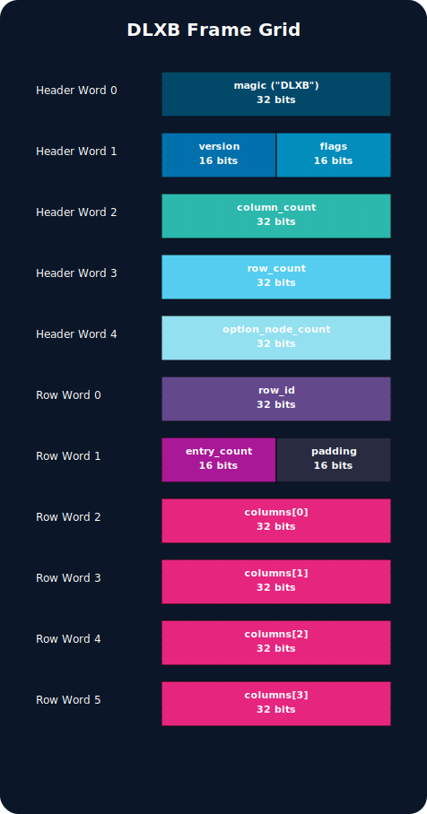
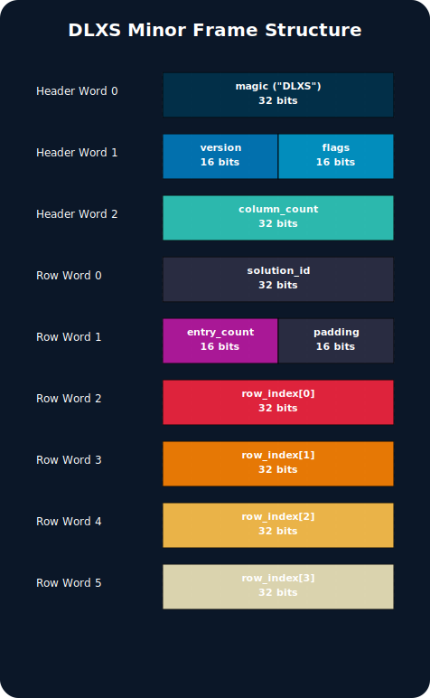
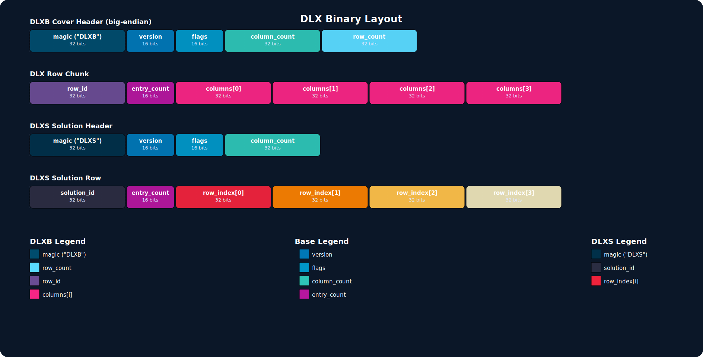

# DLX

<p align="center">
DLX is an efficient recursive, nondeterministic, depth-first search, backtracking algorithm that uses a technique to hide and unhide nodes from a circular doubly linked list in order to find all solutions to some exact cover problem. Many problems can be structured as a complete cover problem such as sudoku puzzles, tiling problems, and even simple scheduling problems. This algorithm was popularlized by Donald Knuth through his "The Art of Computer Programming" series, however gives credit to the algorithm to Hiroshi Hitotsumatsu and Kōhei Noshita with having invented the idea in 1979.

This specific implementation implements the sparse matrix approach and the latest revision of the algorithm, where only 1's are stored in the matrix and the need for linking non header nodes left to right are not necessary. This implementation deploys the use of "spacer nodes" which essentially is a way to determine the current row as well as changing between rows while the searching "dance" is taking place.

</p>

<p align="center">  </p>
<p align="center">  </p>
<p align="center">  </p>
<p align="center">  </p>
<p align="center">  </p>
<p align="center">  </p>

## Build Requirements

- Conan 2.x
- Python 3.9+ (for Conan plugins, documentation tooling, and gcovr/sphinx helpers)
- C++17 & C11 compliant compiler (`g++`, `clang`, MSVC)
- CMake 3.15+
- GCC-style coverage tooling if you plan to run `conan coverage`:
  - `gcov` ships with GCC (install `sudo apt install build-essential` on Ubuntu or `xcode-select --install` on macOS for clang+gcov).
  - `gcovr` for HTML/XML reports (`pip install gcovr` or `brew install gcovr`).
- Documentation toolchain if you plan to run `conan doc` or the manual pipeline:
  - `doxygen` 1.15+ (`brew install doxygen`, `sudo apt install doxygen`, or grab prebuilt binaries from <https://www.doxygen.nl/download.html>).
  - Sphinx + Breathe (installed via `pip install -r docs/sphinx/requirements.txt` or the top-level `requirements.txt` which delegates to the same file).

Example setup commands:

```bash
# macOS (Homebrew)
brew install conan doxygen gcovr
python3 -m pip install -r requirements.txt

# Ubuntu (APT)
sudo apt update
sudo apt install build-essential cmake python3-pip doxygen gcovr
pip3 install --user -r requirements.txt
```

### Conan Workflow

The project ships with a `conanfile.py` plus custom Conan commands to streamline common developer tasks (build/test, coverage, documentation). Before installing dependencies, configure the provided profile and remotes (once per environment):

```bash
conan config install conan  # installs conan/remotes.json, profiles/default & plugins/commands
```

If you prefer to isolate Conan in a Python virtual environment, run:

```bash
python3 -m venv .venv
source .venv/bin/activate   # On Windows use .venv\Scripts\activate
pip install -r requirements.txt
```

Then configure/build:

```bash
# configure dependencies, then invoke the build (Debug profile recommended)
conan install . && conan build . -s build_type=Debug && conan test .

# run unit tests (performance suites excluded, uses binaries in ./build)
conan test . -s build_type=Debug

# run all suites (unit + performance) with 12-way parallel ctest
conan test . -s build_type=Debug -o run_performance_tests=True

# optional: generate coverage report (requires gcov/gcovr)
conan coverage . --build-folder build-debug --cov-path coverage/ --theme github.dark-green

# optional: generate Doxygen XML + Sphinx HTML docs (requires doxygen+sphinx)
CONAN_HOME=$(pwd)/conan PYTHONPATH=$(pwd) conan doc --build-folder build-debug --sphinx-output docs/build/sphinx
```

Unit tests exclude the performance harnesses unless you explicitly request them. Use `conan test .`
for the standard suites, add `-o run_performance_tests=True` to append the performance harnesses
afterward (ctest runs with `-j 12`), or invoke `ctest -L performance` directly if you only want
the performance suites. To clean everything, remove the `build/` directory (`rm -rf build`)
and deactivate/delete the virtual environment when you’re done.

> **Note:** If you already have GoogleTest installed system-wide (e.g., via Homebrew), the build will use that installation. Otherwise, Conan will fetch and build `gtest` from ConanCenter (pass `--build gtest` if a binary isn’t available for your platform).

#### Conan Configuration

You must ensure you have Conan 2.x installed on your build machine. The repo includes the recommended remotes/profile/commands, so you can bootstrap everything with:

```bash
conan config install conan
```

This copies `conan/remotes.json`, `conan/profiles/default`, and the custom command plugins (`coverage`, `doc`) into your Conan home. If you have an existing profile you want to keep, back it up before running the install. Afterward, tweak `~/.conan2/profiles/default` to match your `os`, `arch`, and compiler if needed.

## Sudoku Solver

### Building

Within the cloned repository's main folder `/your_path/DLX`, you can execute the following commands to build the necessary binaries (Debug profile recommended for coverage flags) and run the tests from the existing `build/` tree:

```bash
conan install . && conan build . -s build_type=Debug

# run unit tests only
conan test . -s build_type=Debug

# run all unit + performance tests (ctest -j12)
conan test . -s build_type=Debug -o run_performance_tests=True
```

To collect code coverage, keep building in `Debug` mode and leverage the custom command:

```bash
conan coverage . --build-folder build --cov-path build/coverage-report --theme github.dark-green
```

This emits both `build/coverage/coverage.html` (detailed report) and `build/coverage/coverage.xml` (Cobertura format). Use `--cov-path <dir>` to copy the HTML outputs into an additional directory if needed.

### Execution

#### Sudoku Encoder

The `sudoku_encoder` application takes a sudoku problem file and converts the problem to a DLX binary cover stream. Usage:

```bash
./sudoku_encoder <problem_file> [cover_output_path]
```

If `cover_output_path` is omitted or set to `-`, the cover stream is written to stdout so it can be piped directly into `dlx`. All `sudoku_test*.txt` files under `tests/sudoku_tests/` can be used as encoder input. Writing the binary stream to disk looks like:

```bash
./sudoku_encoder tests/sudoku_tests/sudoku_test.txt sudoku_cover.bin
```

Use the same `-` shorthand to read puzzles from stdin (e.g., `cat puzzle.txt | ./sudoku_encoder - -`).

##### Generating your own Sudoku Input File

If you would like to put in your own solvable sudoku problem into the pipeline, you can create a file of the below format. This example is `sudoku_test3.txt` in the `tests/sudoku_tests/` directory:

```
200301004
600900000
003060001
000600040
475192368
030004000
300070800
000003002
100806005
```

#### DLX

The `dlx` application takes a DLX binary cover matrix as input and emits every possible solution row in both text (stdout) and binary form:

```bash
./dlx <cover_file> [solution_output_path]
```

Passing `-` for either argument switches to stdin/stdout. When the binary solution output is written to stdout, console printing is automatically suppressed; otherwise, human-readable rows are streamed via the sink infrastructure while the DLXS file is written to the requested path.

#### DLX TCP Server

The `dlx` binary also exposes a streaming TCP interface so multiple producers and consumers can share the same solver instance:

```bash
./build/dlx --server <problem_port> <solution_port>
```

- **Problem port** accepts DLXB covers. Each TCP connection represents one problem: write the DLXB header and row chunks, then close the socket.
- **Solution port** emits DLXS frames to every connected client. Clients receive a DLXS header, solution rows, and finally a sentinel row (`solution_id = 0`, `entry_count = 0`) marking the end of that problem. Connections remain open so the next problem arrives as another DLXS header followed by rows.

This design supports any number of encoders pushing work to the solver while multiple decoders listen for answers. See `sudoku_input.py` for an interactive reference that sends ASCII puzzles to the server and decodes solutions from a persistent solution socket.

Behind the scenes each TCP request/response is packetized with DLXB/DLXS headers so the solver can stream many problems over the same sockets. Every problem connection emits:

- A DLXB header + row chunks on the request port.
- A DLXS header + solution rows on the solution port.
- A sentinel (`solution_id = 0`, `entry_count = 0`) signaling end-of-problem while leaving the socket open for the next puzzle.

You can observe the protocol end-to-end via `tests/test_dlx_server.cpp` (unit tests) or by piping real Sudoku grids through `sudoku_input.py`, which consumes ASCII puzzles, pushes them over TCP, and prints each decoded grid as soon as the sentinel arrives.

#### Sudoku Decoder

The `sudoku_decoder` application takes the original sudoku problem file plus the binary solution rows and reconstructs solved grids:

```bash
./sudoku_decoder <problem_file> [solution_file] [answer_file]
```

Omit `solution_file` or `answer_file` (or pass `-`) to stream stdin/stdout respectively. A typical invocation looks like:

```bash
./sudoku_decoder tests/sudoku_tests/sudoku_test.txt dlx_solution_output.bin tests/sudoku_example/sudoku_solution.txt
```

The `sudoku_test.txt` file under `tests/sudoku_tests/` is an example puzzle, and `tests/sudoku_example/sudoku_solution.txt` contains the expected solved grid.

#### End-to-End Pipeline Example

With the streaming sink in place, the full Sudoku workflow can be chained without temporary files:

```bash
./build/sudoku_encoder tests/sudoku_tests/sudoku_test.txt \
  | ./build/dlx \
  | ./build/sudoku_decoder tests/sudoku_tests/sudoku_test.txt \
  > answers
```

This command uses binary I/O for every hop and writes the solved grids into `answers`. When outputs are omitted, each stage automatically streams via stdin/stdout.

### DLX Binary Interchange (DLXB/DLXS)

The DLX toolchain ships with a compact binary format designed for fast streaming between the encoder, solver, and decoder. Two record types exist:

<table align="center">
<tr><th>Identifier</th><th>Magic</th><th>Purpose</th></tr>
<tr><td align="center"><code>DLXB</code></td><td align="center"><code>0x444C5842</code></td><td>Cover matrix serialization (produced by <code>sudoku_encoder</code>, consumed by <code>dlx</code>).</td></tr>
<tr><td align="center"><code>DLXS</code></td><td align="center"><code>0x444C5853</code></td><td>Solution stream (written by <code>dlx</code>, consumed by <code>sudoku_decoder</code>).</td></tr>
</table>

All integers are stored in network byte order (big-endian).

#### DLXB Binary Minor Frame

 An entire `DLXB` minor frame is composed of a single header followed by a sequence of row chunks:

<table align="center">
<tr><th>Field</th><th>Bits</th><th>Description</th></tr>
<tr><td align="center"><code>magic</code></td><td align="center">32</td><td>ASCII <code>\"DLXB\"</code> sentinel.</td></tr>
<tr><td align="center"><code>version</code></td><td align="center">16</td><td>Current value <code>1</code> (<code>DLX_BINARY_VERSION</code>).</td></tr>
<tr><td align="center"><code>flags</code></td><td align="center">16</td><td>Reserved; writers set to <code>0</code>.</td></tr>
<tr><td align="center"><code>column_count</code></td><td align="center">32</td><td>Number of constraint columns in the cover matrix.</td></tr>
<tr><td align="center"><code>row_count</code></td><td align="center">32</td><td>Number of option rows serialized (for statistics).</td></tr>
</table>

<p align="center">
  
</p>

##### DLXB Binary Row Chunk

Each `DLXB` row chunk immediately follows the header and uses the layout:

1. `row_id` (32 bits) — monotonically increasing identifier for the row.
2. `entry_count` (16 bits) — number of column indices present (always 4 for Sudoku).
3. `columns[i]` (`entry_count` × 32 bits) — zero-based column indices marking the `1` entries.

Readers call `dlx_read_row_chunk` until it returns `0`, which indicates EOF. Because the `entry_count` field is 16-bit, individual rows can reference up to 65,535 columns, which is well beyond the Sudoku requirement.

#### DLXS Binary Minor Frame

`DLXS` solution files mirror the cover header with a lighter structure:

<table align="center">
<tr><th>Field</th><th>Bits</th><th>Description</th></tr>
<tr><td align="center"><code>magic</code></td><td align="center">32</td><td>ASCII <code>\"DLXS\"</code>.</td></tr>
<tr><td align="center"><code>version</code></td><td align="center">16</td><td><code>DLX_BINARY_VERSION</code>.</td></tr>
<tr><td align="center"><code>flags</code></td><td align="center">16</td><td>Reserved for future metadata.</td></tr>
<tr><td align="center"><code>column_count</code></td><td align="center">32</td><td>Column count required to interpret row identifiers.</td></tr>
</table>

<p align="center">
  
</p>

Each solution row uses the serialized layout:

1. `solution_id` (32 bits) — monotonically increasing identifier assigned by the solver.
2. `entry_count` (16 bits) — number of row indices that follow.
3. `row_indices[i]` (`entry_count` × 32 bits) — identifiers of the option rows that compose the solution.

When streaming across sockets (e.g., the TCP server), `dlx` emits a **sentinel packet** after the final solution of each problem. The sentinel is encoded as a solution row with `solution_id = 0` and `entry_count = 0`. Consumers that stay connected should treat the sentinel as an end-of-problem marker and wait for the next DLXS header to begin processing the following puzzle (one DLXS header + rows per problem). File-based workflows can simply stop reading at EOF—the sentinel is primarily for the TCP interface so a single connection can carry multiple problems.

##### DLXS Binary Solution Row

Each `DLXS` solution row immediately follows the header and uses the layout:

1. `solution_id` (32 bits) — sequential ID assigned by the solver.
2. `entry_count` (16 bits) — number of row identifiers composing the solution.
3. `row_index[i]` (`entry_count` × 32 bits) — the `row_id` values emitted in the `DLXB` stream.

If `entry_count` is zero the decoder has reached the end of the solution list. The decoder enforces Sudoku constraints by replaying the row indices against the original puzzle metadata.

The following diagram highlights the byte layout of the DLXB and DLXS sections (boxes are drawn left-to-right from the most significant bits down):



For a higher fidelity look at how a specific DLXB/DLXS frame maps into contiguous 32-bit words (with per-field legends), review the diagrams above in their respective sections.

## Tests

### Unit Test Suites

#### `test_sudoku_encoder`
Exercises the Sudoku encoder library by converting canonical `tests/sudoku_tests/*.txt` puzzles into DLXB covers and validating that the generated binary layouts contain the expected number of rows, column headers, and candidate wires. These tests catch regressions in constraint generation (prefilled digits, row counts, column indices).

#### `test_sudoku_decoder`
Feeds known DLXS solution rows plus the original puzzle into the decoder and verifies that the emitted text grids match `tests/sudoku_example/sudoku_solution.txt`. Failures surface deserialization errors or solution-to-grid mapping bugs.

#### `test_sudoku_pipeline`
Runs the full encoder → solver → decoder pipeline using the compiled binaries (no test doubles). Each run writes an answers file and compares it to the expected text solution to guarantee CLI wiring and streaming flags still work.

#### `test_dlx_binary`
Focuses on the core DLX binary solver: it converts ASCII covers, runs search, and compares emitted rows against known solution sets. It also round-trips DLXS rows through the binary writer/reader helpers to ensure serialization stability.

#### `test_dlx_server`
Boots the TCP server in-process and drives multiple client connections. The suite verifies that the request port accepts DLXB payloads, that every solution subscriber receives the same DLXS stream, and that connections survive multiple sequential problems.

#### `test_solution_sink`
Validates the sink abstraction that DLX uses to stream solutions. Tests cover fan-out (one solution routed to many sinks), `ostream` formatting, and accumulation ordering so downstream integrations can trust the hook points.

#### `test_matrix_dump`
Loads the ASCII templates under `tests/generic_tests/` and ensures the matrix-dump utilities produce deterministic, human-readable layouts. This guards against inadvertent formatting changes that would break tooling which consumes the dumps.

#### `test_dlx_search_performance` (unit wrapper)
Although the name mentions performance, the executable also provides basic verification that the synthetic matrix generator accepts the current YAML config. It runs lightweight cases whenever unit tests are executed, failing fast if the config references invalid fields.

### Performance Test Suites

Performance suites are opt-in (`conan test . -o run_performance_tests=True`) and are labeled `performance` in CTest. They run after the unit suites complete.

#### `test_dlx_search_performance`
This harness constructs the param-driven matrices defined in `tests/config/performance_config.yaml`. Each case specifies column counts, group counts, and variants per group. The generator:

- Splits the column range into evenly sized groups so the solver explores disjoint sets.
- Emits `variants_per_group` identical rows per group, yielding a predictable search tree with `variants_per_group^group_count` solutions.
- Links nodes exactly like `Core::generateMatrixBinaryImpl`, ensuring parity with production wiring.

Cases fan out across hardware threads, and each successful run appends a row to `tests/performance/dlx_search_performance.csv` (columns/groups/variants/solutions/duration). Any mismatch in expected solution counts or timeouts will fail the suite, catching regressions in search pruning or matrix generation.

#### `test_dlx_network_performance`
Drives the TCP server end-to-end while issuing bursts of Sudoku requests to measure throughput. The YAML config’s `network_performance` block controls the DLXB problem file, request rate, burst sizing, and duration. Each test logs per-second solve counts, solution completion counts, and latencies to `tests/performance/dlx_network_throughput.csv`, highlighting regressions in concurrency control, rate limiting, or socket handling.

Notes on interpreting the CSV:
- **Solve Rate vs. Solution Rate** — Solve Rate is measured when the client receives a solution header; Solution Rate is measured when the terminator row arrives. With buffered socket output these two can be identical when the stream drains quickly. Divergence typically indicates output backpressure or client lag.
- **Target rate throttling** — The harness actively paces submissions toward `target_solution_rate`, so a flat rate equal to the target does not necessarily imply saturation. Raise the target or increase request clients to probe capacity.
- **Latency includes queueing** — The reported latency includes queueing in the TCP server problem/solution queues. If you want pure solver time, compare Solve Rate to Solution Rate or instrument server-side timestamps.

#### `performance_config.yaml`
Both performance suites are driven by `tests/config/performance_config.yaml` (an example lives beside it). By default the loader expects that relative path; set the `DLX_PERF_CONFIG` environment variable to point at an alternate absolute or relative location (relative paths are resolved against the repository root via `DLX_SOURCE_DIR`). If the file cannot be read the suites stay disabled.

The document uses this shape:

```yaml
tests:
  search_performance:
    enabled: false
    report_path: tests/performance/dlx_search_performance.csv
    cases:
      - column_count: 1000
        group_count: 3
        variants_per_group: 2
  network_performance:
    enabled: false
    duration_seconds: 10
    request_clients: 1
    solution_clients: 1
    target_solution_rate: 1000
    problem_file: tests/sudoku_example/sudoku_cover.txt
    report_path: tests/performance/dlx_network_throughput.csv
```

Field reference:

- `tests.search_performance.enabled` — turn the DLX search benchmarks on/off. When `true` provide at least one `cases[]` entry, each containing `column_count`, `group_count`, and `variants_per_group` (positive integers). If omitted, the built-in defaults from `performance_test_config.h` are used.
- `tests.search_performance.report_path` — CSV destination for aggregated timings; defaults to `tests/performance/dlx_search_performance.csv`.
- `tests.search_performance.cases[]` — describes the matrices to instantiate. Each case is required to specify `column_count`, `group_count`, and `variants_per_group`.
- `tests.network_performance.enabled` — enables the network throughput harness. When `true`, `problem_file` must point at a DLXB cover (usually `tests/sudoku_example/sudoku_cover.txt` or a custom path).
- `tests.network_performance.duration_seconds` — how long to run the benchmark (per configuration) before collecting stats.
- `tests.network_performance.request_clients` / `solution_clients` — number of concurrent producer threads and subscriber sockets to spawn.
- `tests.network_performance.target_solution_rate` — approximate solutions-per-second goal used to tune the throttling controller.
- `tests.network_performance.problem_file` — DLXB payload sent to the TCP server (required when enabled).
- `tests.network_performance.report_path` — CSV destination for throughput samples; defaults to `tests/performance/dlx_network_throughput.csv`.

You may copy the `tests/config/performance_config.yaml` into your workspace and tweak the blocks above, or point `DLX_PERF_CONFIG` at a per-user file to avoid modifying the repository defaults.

### Documentation

This project uses Doxygen to extract C++ APIs into XML, then Sphinx+Breathe to transform that into HTML. The generated site is grouped into Core, Sudoku, and Tooling sections with a full API reference for quick navigation.

1. Install the toolchain once: `pip install -r docs/sphinx/requirements.txt`.
2. Generate docs automatically with the Conan helper:  
   `CONAN_HOME=$(pwd)/conan PYTHONPATH=$(pwd) conan doc --build-folder build --sphinx-output docs/build/sphinx`
3. Prefer a pure CMake/Sphinx flow? Run `cmake --build build --target doxygen-docs` then  
   `sphinx-build -b html docs/sphinx docs/build/sphinx`.

Open `docs/build/sphinx/index.html` in your browser to explore the Core modules, Sudoku encoder/decoder, and tooling sections. The default site now uses the Material theme (`sphinx-material` package). If you prefer a different look, place custom CSS/JS in `docs/sphinx/_static` or change `html_theme` inside `docs/sphinx/conf.py` (Groundwork is still available via the bundled dependency).
